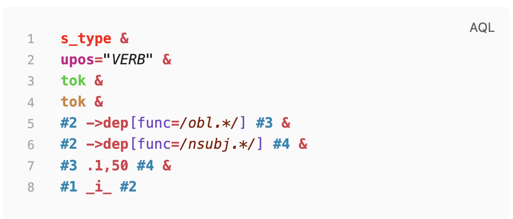

# AQL Syntax Highlighting

ANNIS Query Language (AQL) syntax highlighting for Obsidian code blocks.

## What Is ANNIS?

ANNIS (ANNotation of Information Structure) is an open-source search and
visualization platform for richly annotated linguistic corpora.

- Official ANNIS repository: https://github.com/korpling/ANNIS
- ANNIS documentation homepage: http://corpus-tools.org/annis/

## Features

- Registers an AQL CodeMirror mode for fenced code blocks.
- Supports token highlighting for strings, operators, metadata, node references, and node classes.
- Ships styling in `styles.css`, so highlighting works out of the box after install.

## Install

### Community plugins (easiest)

1. Open **Settings -> Community plugins**.
2. Turn off Safe mode (if needed).
3. Search for **AQL Syntax Highlighting**.
4. Install and enable.

### Manual install

1. Download the latest release from GitHub.
2. Copy `manifest.json`, `main.js`, and `styles.css` into:
   - `<your-vault>/.obsidian/plugins/aql-syntax-highlighting/`
3. In Obsidian, open **Settings -> Community plugins** and enable **AQL Syntax Highlighting**.

## Screenshot

Highlighted AQL example in an Obsidian code block:



## Usage

Use fenced code blocks with the language tag `aql`:

````markdown
```aql
cat="PP" & cat="NP" & #1 > #2
```
````

Another example:

````markdown
```aql
tok="learning" & pos="NN" & #1 . #2
```
````

## Update

### Community plugins

- Use **Settings -> Community plugins -> Check for updates**.

### Manual install

- Replace `manifest.json`, `main.js`, and `styles.css` with files from the latest release.
- Reload Obsidian (or disable and re-enable the plugin).

## Development

Requirements:

- Node.js 16+
- npm

Install and build:

```bash
npm ci
npm run build
```

Watch mode during development:

```bash
npm run dev
```

Visual validation screenshots (before/after):

```bash
npm run test:visual
```

If Playwright is missing, install it once:

```bash
npm install --save-dev playwright
```

Artifacts are written to:

- `tests/artifacts/validation-before.png`
- `tests/artifacts/validation-after.png`

## Optional Customization

If you want to override the default colors:

1. Create a file in your vault at `.obsidian/snippets/aql-highlighting-custom.css`.
2. Paste your CSS overrides (example below).
3. In Obsidian, go to **Settings -> Appearance -> CSS snippets**.
4. Enable `aql-highlighting-custom`.
5. Reload Obsidian if changes do not appear immediately.

Example snippet:

```css
/* AQL token overrides */
.cm-s-obsidian .cm-string {
   color: #2aa198;
   font-style: italic;
}

.cm-s-obsidian .cm-operator {
   color: #dc322f;
   font-weight: 700;
}

.cm-s-obsidian .cm-node_1 {
   color: #268bd2;
   font-weight: 700;
}
```


## Release Checklist

1. Update `manifest.json` version.
2. Update `versions.json` with the new version to minAppVersion mapping.
3. Build with `npm run build`.
4. Create a GitHub release tagged with the same version as `manifest.json`.
5. Upload release assets:
   - `manifest.json`
   - `main.js`
   - `styles.css`

## License

MIT. See `LICENSE`.
